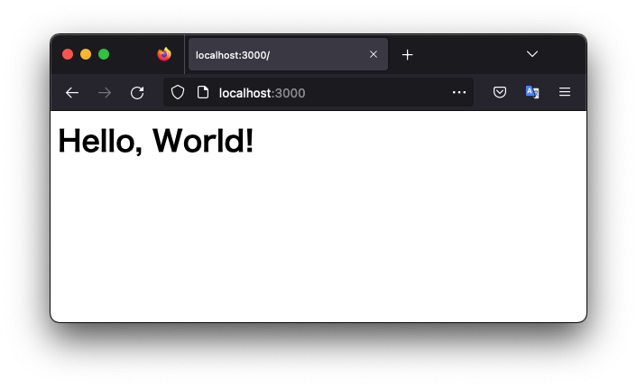

# axum hello

Simple axum example.

Using [axum](https://github.com/tokio-rs/axum).


```toml
[dependencies]
axum = "0.5"
tokio = { version = "1.22", features = ["full"] }
```

## Build

```shell
$ cargo build
```

## Run

```shell
$ cargo run
```





