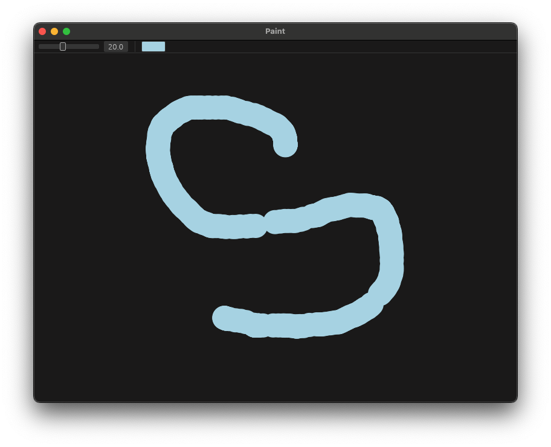

# egui paint

```rust
use eframe::egui;

fn main() -> eframe::Result {
    let native_options = eframe::NativeOptions::default();
    eframe::run_native(
        "Paint",
        native_options,
        Box::new(|cc| {
            Ok(Box::new(PaintApp::new(cc)))
        }),
    )
}

struct Line {
    points: Vec<egui::Pos2>,
    color: egui::Color32,
    stroke_width: f32,
}

struct PaintApp {
    lines: Vec<Line>,
    current_line: Vec<egui::Pos2>,
    brush_color: egui::Color32,
    brush_size: f32,
}

impl Default for PaintApp {
    fn default() -> Self {
        Self {
            lines: Vec::new(),
            current_line: Vec::new(),
            brush_color: egui::Color32::LIGHT_BLUE,
            brush_size: 4.0,
        }
    }
}

impl PaintApp {
    fn new(_cc: &eframe::CreationContext<'_>) -> Self {
        Self::default()
    }
}

impl eframe::App for PaintApp {
    fn ui(&mut self, ui: &mut egui::Ui, frame: &mut eframe::Frame) {

        egui::Panel::top("toolbar").show_inside(ui, |ui| {
            ui.horizontal(|ui| {
                ui.add(egui::Slider::new(&mut self.brush_size, 1.0..=50.0));
                ui.separator();
                ui.color_edit_button_srgba(&mut self.brush_color);
            });
        });

        egui::CentralPanel::default().show_inside(ui, |ui| {

            let (response, painter) = ui.allocate_painter(
                ui.available_size(),
                egui::Sense::drag(),
            );

            for line in &self.lines {
                let stroke = egui::Stroke::new(line.stroke_width, line.color);
                let shapes = line.points.iter()
                    .map(|p| egui::Shape::circle_filled(*p, line.stroke_width, line.color));
                painter.extend(shapes);
            }

            if let Some(pointer_pos) = response.interact_pointer_pos() {
                if response.drag_started() {
                    self.current_line.clear();
                }
                if self.current_line.last() != Some(&pointer_pos) {
                    self.current_line.push(pointer_pos);
                }

                let stroke = egui::Stroke::new(self.brush_size, self.brush_color);
                let preview = self.current_line.iter()
                    .map(|p| egui::Shape::circle_filled(*p, self.brush_size, self.brush_color));
                painter.extend(preview);
            }

            if response.drag_stopped() && !self.current_line.is_empty() {
                self.lines.push(Line {
                    points: self.current_line.clone(),
                    color: self.brush_color,
                    stroke_width: self.brush_size,
                });
                self.current_line.clear();
            }

        });

    }
}
```


