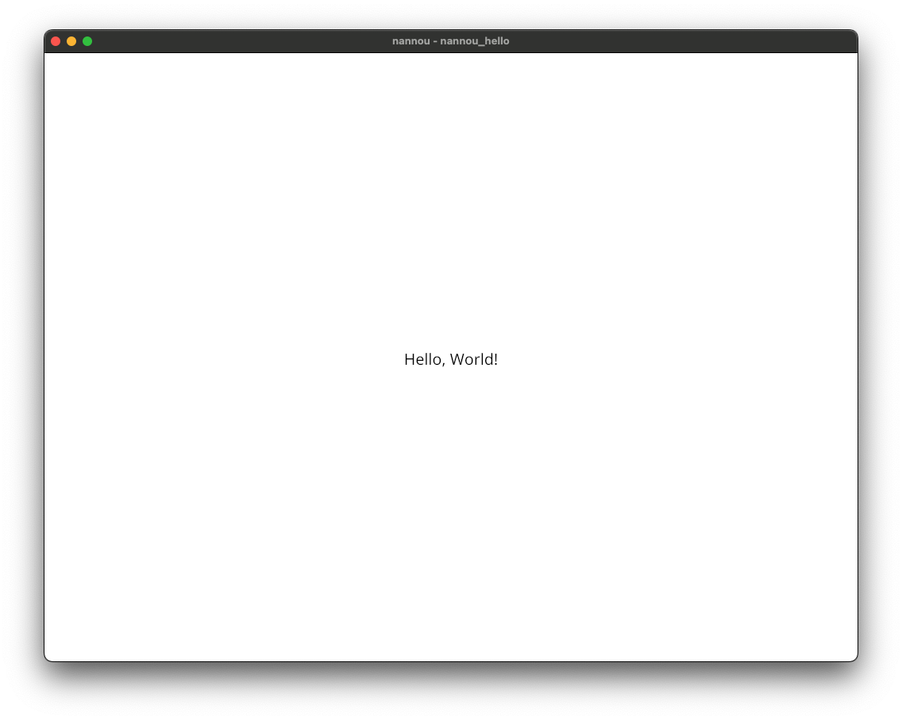

# Nannou hello

```rust
use nannou::prelude::*;

fn main() {
    nannou::app(model)          // Start building the app and specify our `model`
        .event(event)           // Specify that we want to handle app events with `event`
        .update(update)         // rather than `.event(event)`, now we only subscribe to updates
        .simple_window(view)    // Request a simple window to which we'll draw with `view`
        .run();
}

// the Model is where we define the state of our application.
struct Model {}

// The model function is run once at the beginning of the nannou app and produces a fresh,
// new instance of the Model that we declared previously, AKA the app state.
fn model(_app: &App) -> Model {
    Model {}
}

// The event function is some code that will run every time some kind of app event occurs.
fn event(_app: &App, _model: &mut Model, _event: Event) {
}
fn update(_app: &App, _model: &mut Model, _update: Update) {
}

// The view allows us to present the state of the model to a window by drawing to its Frame
// and returning the frame at the end.
fn view(_app: &App, _model: &Model, frame: Frame) {

    frame.clear(WHITE);

    // get canvas to draw on
    let draw = _app.draw();

    draw.text("Hello, World!").font_size(20).color(BLACK);
    draw.to_frame(_app, &frame).unwrap();
}
```


## Build

```shell
$ cargo build
```

## Run

```shell
$ cargo run
```



