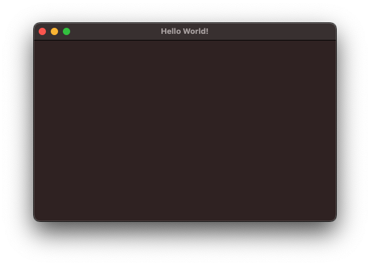

# Window cocoa

Simple macOS window app.

Using [cocoa crates](https://github.com/servo/core-foundation-rs).


```toml
[dependencies]
cocoa = "0.24.1"
```

## Build

```shell
$ cargo build
```

## Run

```shell
$ cargo run
```





