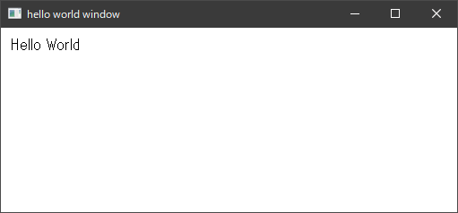

# Window win32

Simple Windows window app.

Using [windows crates](https://github.com/microsoft/windows-rs).


```toml
[dependencies.windows]
version = "0.43.0"
features = [
    "Win32_Foundation",
    "Win32_Graphics_Gdi",
    "Win32_System_LibraryLoader",
    "Win32_UI_WindowsAndMessaging",
]
```

## Build

```shell
$ cargo build
```

## Run

```shell
$ cargo run
```





