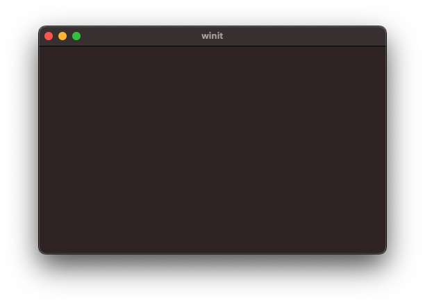

# Winit

Simple window of winit crate.

Using [winit](https://github.com/rust-windowing/winit).


```toml
[dependencies]
winit = "0.27"
```

## Build

```shell
$ cargo build
```

## Run

```shell
$ cargo run
```





