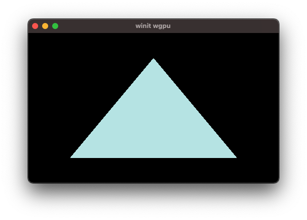

# Winit wgpu

Wgpu on winit.

Using [wgpu](https://github.com/gfx-rs/wgpu).


```toml
[dependencies]
log = "0.4"
env_logger = "0.9"
futures = "0.3"
winit = "0.27"
wgpu = "0.14"
```

## Build

```shell
$ cargo build
```

## Run

```shell
$ cargo run
```





