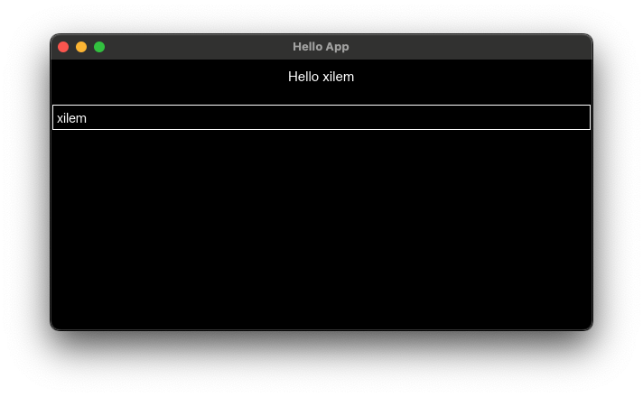

# xilem hello

Simple [xilem](https://github.com/linebender/xilem) example.


```toml
[dependencies]
xilem = "0.3.0"
winit = "0.30.12"
```

```rust
use winit::error::EventLoopError;
use winit::window::Window;
use xilem::view::{flex, label, textbox, FlexSpacer};
use xilem::{EventLoop, WidgetView, Xilem};
use xilem::dpi::LogicalSize;

struct State {
    text: String,
}

fn app_logic(data: &mut State) -> impl WidgetView<State> + use<> {
    flex((
        FlexSpacer::Fixed(1.0),
        label(format!("Hello {}", data.text)),
        FlexSpacer::Fixed(1.0),
        textbox(data.text.clone(), |state: &mut State, new_value| {
            state.text = new_value;
        }),
    ))
}

fn main() -> Result<(), EventLoopError> {
    let app = Xilem::new(State { text: "xilem".to_string() }, app_logic);
    app.run_windowed_in(
        EventLoop::with_user_event(),
        Window::default_attributes()
                     .with_title("Hello App")
                     .with_resizable(true)
                     .with_inner_size(LogicalSize::new(600., 300.))
    )?;
    Ok(())
}
```

## Build

```shell
$ cargo build
```

## Run

```shell
$ cargo run
```




